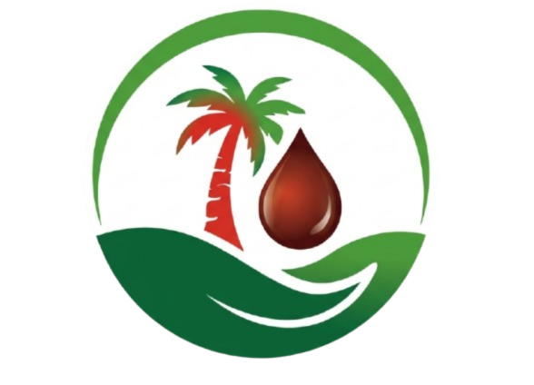

# Kayangana Eco-Palms — Website Documentation

**Last updated:** March 20, 2026  
**Stack:** HTML5, Bootstrap 5, AOS, Swiper, GLightbox, custom CSS  
**Template base:** BootstrapMade AgriCulture template (fully rewritten)

---

## Project Overview

A 5-page static website for **Kayangana Eco-Palms**, a startup from Burundi building a mechanized, community-centered palm oil Smart Hub in Rumonge. The site supports the team's FAST/MasterCard funding application and ACE Incubator program at Ashesi University.

---

## File Structure

```
/
├── index.html              # Homepage
├── about.html              # About Us + Team
├── services.html           # Our Solution (Smart Hub)
├── blog.html               # Our Journey (milestones + posts)
├── contact.html            # Contact + funding info
│
├── assets/
│   ├── css/
│   │   ├── main.css        # Base template styles (do not edit)
│   │   └── kayangana.css   # All custom overrides (edit here)
│   ├── js/
│   │   └── main.js         # Template JS (AOS, Swiper, etc.)
│   └── vendor/             # Bootstrap, AOS, Swiper, GLightbox
│
├── Field Research Photos/
│   ├── Palm-oil-plantation-scaled.jpg   # Page title banner background
│   ├── palmOilPlantation.jpg
│   ├── smookFromOilProduction.jpg
│   ├── workInPalms.jpg
│   └── Field Research Photos/           # WhatsApp field visit photos (15 images)
│
├── Incubator_Program_Pictures/
│   ├── WhatsApp Image 2026-03-20 at 11.33.58 AM.jpeg    # Used in blog post + detail
│   ├── WhatsApp Image 2026-03-20 at 11.33.58 AM (1).jpeg
│   └── WhatsApp Image 2026-03-20 at 11.33.59 AM.jpeg
│
├── ProposedSolution_Pictures/
│   ├── logo.png             # Official Kayangana logo (used in all headers)
│   ├── unnamed.jpg
│   └── WhatsApp Image 2026-01-27 at 1.43.*.jpeg  (6 solution images)
│
├── Team/
│   ├── CEO.png
│   ├── CTO.jpg
│   └── Head of Operation.jpeg
│
└── forms/
    ├── contact.php
    └── newsletter.php
```

---

## Pages

### index.html — Homepage
- Fixed header with real PNG logo (`ProposedSolution_Pictures/logo.png`)
- Hero: full-viewport carousel (5 slides) using field research photos
  - Slide 1 opens with **"Welcome to Kayangana Eco-Palms"** pill badge above the headline
- Sections: Our Approach (3 pillars) → The Problem → Our Solution (photo grid + funding ask) → Market → Newsletter CTA

### about.html — About Us
- Page title banner: `Palm-oil-plantation-scaled.jpg`
- Sections: Who We Are → Our Vision (3 cards) → Team (CEO, CTO, Head of Operations) → Kayangana Foundation → Newsletter CTA

### services.html — Our Solution
- Page title banner: `Palm-oil-plantation-scaled.jpg`
- Sections: Smart Hub Model (4 differentiators) → Solution in Action (6 cards, images matched to descriptions) → Funding (field research photo) → Why Kayangana comparison table → Newsletter CTA
- Solution card image mapping:
  - Motorized Oil Expellers → `1.43.05 AM.jpeg`
  - Filtration & Branded Packaging → `1.43.32 AM.jpeg`
  - Eco-Charcoal & Fertilizer → `1.43.06 AM.jpeg`
  - Solar Power → `1.43.04 AM.jpeg`
  - Direct Farmer Partnerships → field research photo
  - Community Service Hub → `1.43.20 AM.jpeg`

### blog.html — Our Journey
- Page title banner: `Palm-oil-plantation-scaled.jpg`
- 4 posts (2×2 grid):
  1. We Got Into the ACE Incubator (incubator photo, March 2026)
  2. The Visit That Changed Everything — origin story from founder's field visit to Rumonge, NOT a classroom (field research photo)
  3. On the Ground in Rumonge (field research photo)
  4. The Numbers Don't Lie — market gap data (field research photo)
- ACE Incubator detail section: single full photo (`11.33.58 AM.jpeg`) + description text
- Newsletter CTA

### contact.html — Contact
- Page title banner: `Palm-oil-plantation-scaled.jpg`
- Google Maps embed (Rumonge, Burundi)
- Contact info: location, email, ACE program, funding goal
- Contact form (PHP)
- Why Support Us (4 cards) → Newsletter CTA

---

## Header (all 5 pages)

```html
<a href="index.html" class="kep-logo">
  
  <span class="brand-name">Kayangana Eco-Palms</span>
</a>
```

- Position: `fixed` — stays visible on scroll
- Logo: real PNG (palm tree + red oil drop + green circle design)
- Brand name only — tagline removed
- Nav links: uppercase with green underline hover effect
- "Contact" nav item: styled as green pill CTA button
- Green gradient stripe along bottom of header

---

## Custom CSS — `assets/css/kayangana.css`

Key rules (all overrides go here, never edit `main.css`):

| Rule | Purpose |
|------|---------|
| `.header { position: fixed !important }` | Sticky header on all pages |
| `body { padding-top: 80px }` | Offset content below fixed header |
| `.kep-logo-icon { height: 52px }` | PNG logo sizing |
| `.kep-logo .brand-name` | Marcellus serif, green, 17px |
| `.page-title { padding: 160px 0 100px; min-height: 420px }` | Tall consistent banner on all inner pages |
| `.page-title:before { rgba(0,0,0,0.45) }` | Dark overlay for text readability |
| `.hero-welcome` | Pill badge on homepage hero slide 1 |
| `background-attachment: fixed` | Parallax effect on page title banners |

---

## Brand Colors

| Name | Hex |
|------|-----|
| Primary green | `#116530` |
| Light green | `#2ea359` |
| Muted green | `#5a8a6a` |
| Text dark | `#2d3a2e` |

---

## Key Content Facts (do not change)

- Rumonge = 63%+ of Burundi's palm grove area
- National demand: 300,000 tons/year
- Current production: 20,000 tons/year (280,000-ton gap)
- International acidity limit: 10.0 mg KOH/g
- Pilot Smart Hub budget: $5,000 total
- ACE Incubator secured: $1,500 (30%)
- Remaining funding gap: $3,500 (70%)
- Email: kayangana.ecopalms@gmail.com

---

## Known Constraints

- Folder names with spaces (e.g. `Field Research Photos/`) must use `%20` in CSS `url()` values and be quoted: `url('Field%20Research%20Photos/...')`
- `main.css` is the base template — never edit it directly, use `kayangana.css` for all overrides
- Forms (`contact.php`, `newsletter.php`) require a PHP server to function — won't work on plain file:// preview
